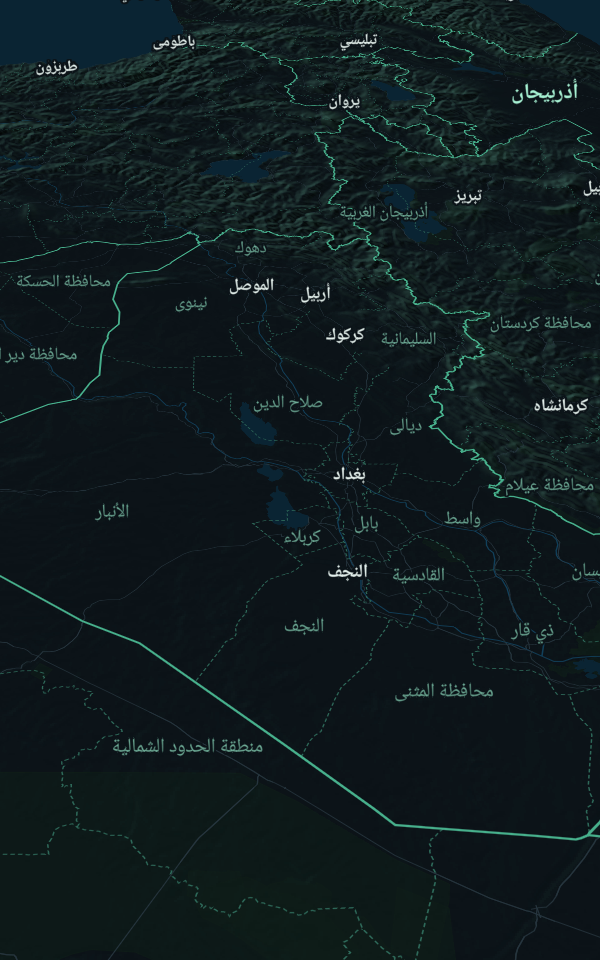
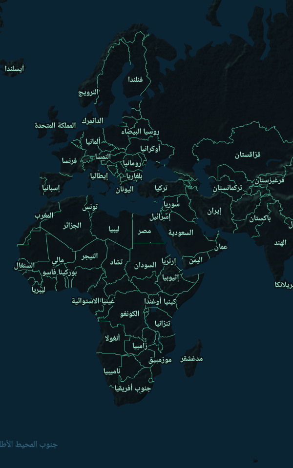
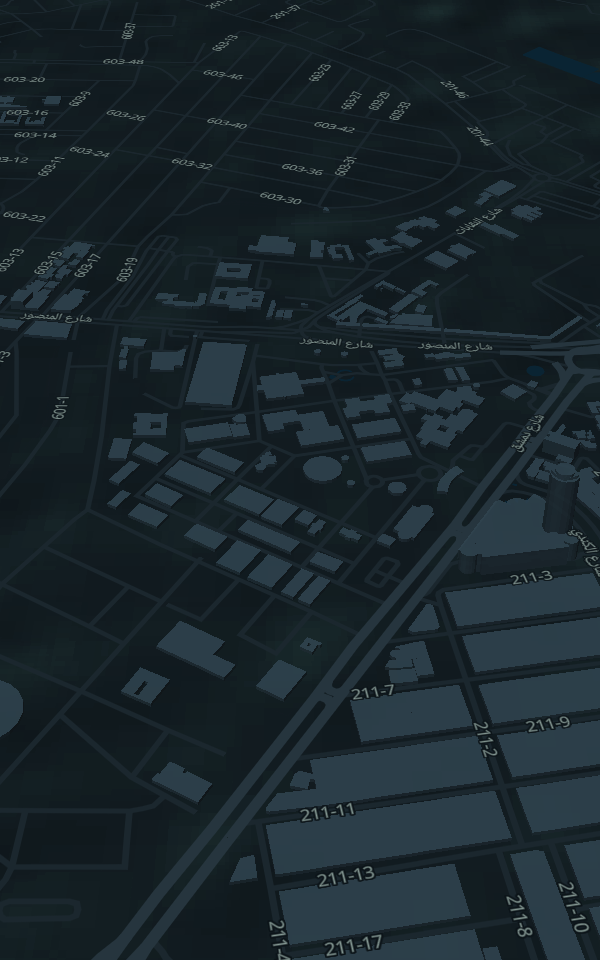

# سكاي مونيتر العراق — Sky Monitor Iraq

**تطوير: المبرمج المجهول** · الإصدار 2.0.0

تطبيق Android لاستكشاف حركة الطيران المنشورة علناً حول العالم، مع تركيز على أجواء العراق.
يعرض فقط الطائرات التي تبث بيانات ADS-B/MLAT وتنشرها شبكات تتبّع عامة، ويُبرز طرازات
**MQ-9 Reaper** و**MQ-1 Predator** و**RQ-4 Global Hawk** حين — وفقط حين — تظهر في تلك البيانات.

> المعلومات المعروضة تعتمد على مصادر طيران عامة، وقد تكون بعض الطائرات العسكرية غير ظاهرة أو بياناتها متأخرة أو محجوبة.

| العراق (ثلاثي الأبعاد) | العالم | بغداد — مبانٍ ثلاثية الأبعاد |
|---|---|---|
|  |  |  |

## التحميل
**[⬇ تحميل SkyMonitorIraq-v2.0.0.apk](https://github.com/almajhool-dev/almajhool-ap/raw/sky-monitor-iraq/release/SkyMonitorIraq-v2.0.0.apk)** — Android 8 فأعلى.

## الميزات
- خريطة متجهية داكنة بأسماء عربية لكل الدول والمحافظات والمدن والشوارع، مع تضاريس بارزة ومبانٍ ثلاثية الأبعاد ووضع 2D/3D.
- الطائرات تتحرك بسلاسة على الخريطة بين التحديثات، مع خط المسار الذي قطعته منذ الإقلاع (OpenSky) واتجاهها الحالي.
- أيقونات طائرات واقعية، وشكل خاص للمسيّرات MQ-9/MQ-1/RQ-4.
- خريطة عالمية تفاعلية بطابع رادار داكن، مع انتقال مباشر إلى العراق.
- فلاتر: العراق فقط · العالم · الطائرات المدنية · الفئات المصنّفة علناً (عسكرية/حكومية) · MQ-9/MQ-1/RQ-4.
- بحث بالنداء أو التسجيل أو الطراز (MQ-9، RQ-4، Reaper…) في البيانات المحمّلة وفي المصدر مباشرة.
- لوحة تفاصيل: النوع، الطراز، الارتفاع، السرعة، الاتجاه، آخر تحديث، الفئة، ومصدر البيانات.
- صفحة «مصدر البيانات»: الـ API المستخدم، شروطه، آخر تحديث ناجح، ومتوسط تأخر البيانات، وأي خطأ.
- تعامل مع انقطاع الإنترنت، أخطاء الخوادم، تجاوز حدود الطلبات، والمناطق الخالية من البيانات.
- تحديث تلقائي كل 20 ثانية يتوقف حين يكون التطبيق في الخلفية.

## مصادر البيانات (عامة ومجانية للاستخدام غير التجاري مع ذكر المصدر)
| المصدر | الاستخدام في التطبيق | الحدود |
|---|---|---|
| [adsb.fi Open Data](https://github.com/adsbfi/opendata) | المواقع حول نقطة (نصف قطر 250 ميلاً بحرياً)، قائمة الطائرات المصنّفة علناً، البحث بالنداء/التسجيل | طلب واحد في الثانية |
| [OpenSky Network](https://openskynetwork.github.io/opensky-api/rest.html) | مربع العراق أو مساحة العرض الحالية | حصة يومية محدودة للمستخدم المجهول → استعلام كل 5 دقائق |
| [OpenFreeMap](https://openfreemap.org) / OpenMapTiles / © OpenStreetMap | الخريطة المتجهية والأسماء العربية | مجانية بدون مفتاح |
| [AWS Terrain Tiles](https://registry.opendata.aws/terrain-tiles/) | التضاريس | بيانات مفتوحة |

## ما لا يفعله التطبيق
- لا يكشف الطائرات الشبحية ولا أي طائرة لا تبث بيانات عامة.
- لا يعترض أي اتصالات ولا يتجاوز أي أنظمة حماية ولا يصل إلى بيانات غير منشورة.
- لا يستنتج تصنيف الطائرة؛ فئة «مصنّفة علناً» مأخوذة كما هي من قاعدة بيانات المصدر.

## البناء
```bash
./gradlew assembleRelease          # app/build/outputs/apk/release/app-release.apk
./gradlew testReleaseUnitTest      # اختبارات المحلّل + اتصال حي بالمصادر
```
التوقيع: ضع `keystore.properties` (storeFile, storePassword, keyAlias, keyPassword) في جذر المشروع،
أو في GitHub Actions أضف الأسرار `KEYSTORE_BASE64`, `KEYSTORE_PASSWORD`, `KEY_ALIAS`, `KEY_PASSWORD`.
بدونها يُوقَّع الإصدار بمفتاح التصحيح.

**المتطلبات:** Android 8.0 فأعلى · Kotlin · Jetpack Compose · MapLibre.
